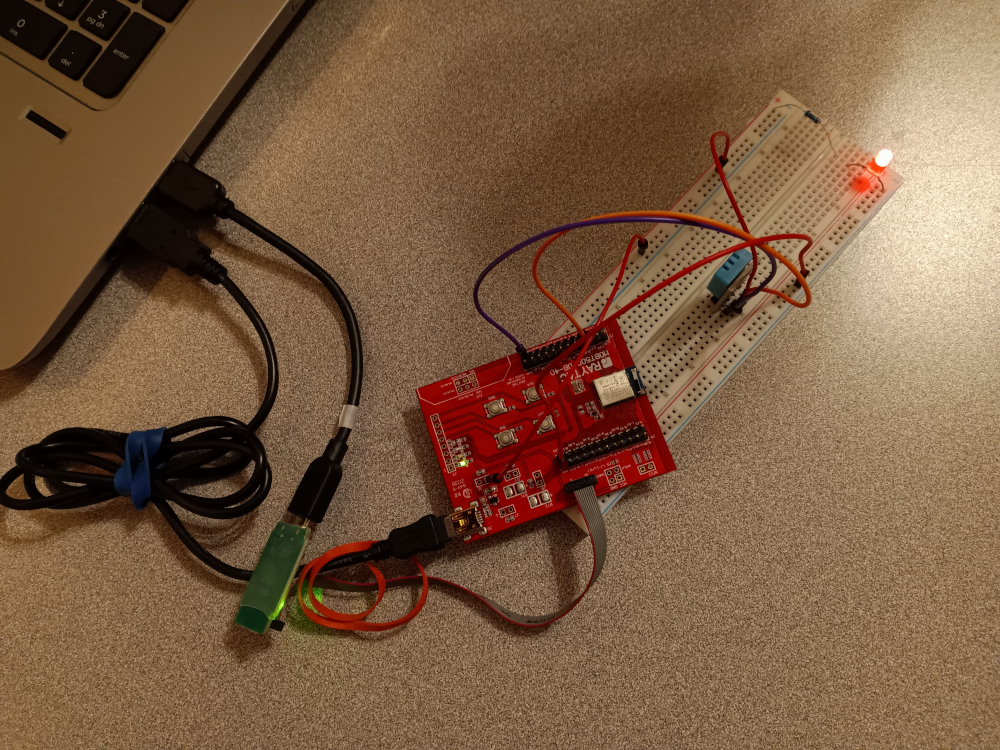

<h1 align="center">Hi 👋, I'm Sarah</h1>
<h3 align="center">I'm a Jetpack Compose, Web, and API developer focused on great user experiences and quality apps.</h3>

- 🔭 I’m currently working on a Food Tracker Jetpack Compose/Android app. It will include both free and paid variants.

- 👯 My contributions:
     * [JetBrains - `kotlin-wrappers`](https://github.com/JetBrains/kotlin-wrappers/tree/master/kotlin-emotion)
     * [Google Home Sample App for Matter](https://github.com/google-home/sample-app-for-matter-android/pulls?q=is%3Apr+author%3Asarah-iot)
     * [Code with the Italians](https://github.com/code-with-the-italians/bundel)
     * [OpenThread Repo](https://github.com/openthread/openthread/pulls?q=is%3Apr+author%3Asarah-iot)
     * [OpenThread Docs](https://github.com/openthread/ot-docs/pulls?q=is%3Apr+author%3Asarah-iot)

- 👨‍💻 All of my projects are available at [https://github.com/santansarah?tab=repositories](https://github.com/santansarah?tab=repositories).

- 📝 I regularly publish videos on [https://www.youtube.com/@santansarah](https://www.youtube.com/@santansarah).

- 💬 Ask me about **Adaptive Layouts, JUnit 5 testing**.

- 📫 How to reach me **santansarah@gmail.com**.

- 📄 Know about my experiences [https://docs.google.com/document/d/1uGxA1MDpuiqauvRUXvZPdc-5Mx9GjO6PegIBCFmC7B8/edit?usp=sharing](https://docs.google.com/document/d/1uGxA1MDpuiqauvRUXvZPdc-5Mx9GjO6PegIBCFmC7B8/edit?usp=sharing).

- ⚡ Fun fact **I'm keto - my brain runs on fat instead of carbs🤪. I also love working with IoT devices**.

<h3 align="left">Connect with me:</h3>

<h3 align="left">Languages and Tools:</h3>

                                              

